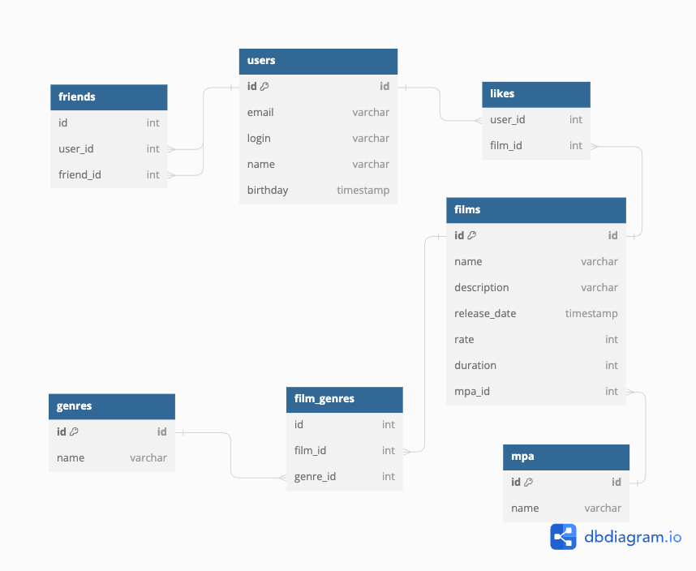

java-filmorate
Template repository for Filmorate project.

```
Table users {
  id id [primary key]
  email varchar
  login varchar
  name varchar
  birthday timestamp
}

Table films {
  id id [primary key]
  name varchar
  description varchar
  release_date timestamp
  rate int
  duration int
  mpa_id int
}

Table mpa {
  id id [primary key]
  name varchar
}

Table genres {
  id id [primary key]
  name varchar
}

Table film_genres {
  id int
  film_id int
  genre_id int
}

Table friends {
  id int
  user_id int
  friend_id int
}

Table likes {
  user_id int
  film_id int
}

Ref: mpa.id < films.mpa_id

Ref: film_genres.film_id > films.id
Ref: film_genres.genre_id > genres.id

Ref: friends.user_id > users.id
Ref: friends.friend_id > users.id

Ref: likes.user_id > users.id
Ref: likes.film_id > films.id


```